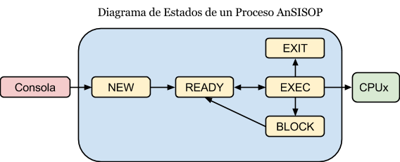

# Proceso Núcleo

El proceso Núcleo es el proceso principal del sistema. Recibirá los Programas AnSISOP y planificará su ejecución en los distintos Procesos CPUs del sistema según el algoritmo Round Robin. Además, será el encargado de resolver las llamadas a sistema de los Programas.

## Arquitectura del Proceso Núcleo

El proceso Núcleo al ser iniciado se conectará con el Proceso Unidad de Memoria Central (UMC), obtendrá el tamaño de página, y quedará a la espera de conexiones por parte de Procesos CPU o Procesos Consola.

Al contar con al menos un Proceso CPU comenzará a planificar los diversos Programas AnSISOP en función del algoritmo de planificación.

* En cualquier momento, instancias de los procesos CPU y procesos Consola pueden ingresar o desconectarse del sistema.
* La falta de procesos CPU en el sistema es posible, en ese caso los Programas AnSISOP quedarán a la espera.

## Creación del PCB

Al recibir la conexión de un nuevo Programa, el Núcleo intercambiará unos mensajes iniciales con el mismo, para luego recibir la totalidad del código fuente del script que se deberá ejecutar.

El Núcleo creará la estructura PCB con al menos los siguientes campos[^3]:

* Un identificador único (PID)
* Program Counter (PC)
* Posición del Stack (SP)

A partir de esta información, el Núcleo deberá inicializar una nueva estructura Stack, solicitarle a la UMC páginas para almacenar el código del programa y páginas para almacenar el stack, y almacenar dichas estructuras.

Si no se pudiera obtener espacio suficiente para algunas de las estructuras necesarias del proceso, entonces se le rechazará el acceso al sistema, informándose oportunamente en el proceso Consola correspondiente a ese Programa.

## Planificación de procesos

Los PCB de los Programas AnSISOP serán enviados a los diversos Procesos CPU para su ejecución en el orden determinado por Round Robin, siguiendo un modelo de 5 estados[^4].

* Recibirá los nuevos PCBs (`NEW`) y los encolará en el estado de listos (`READY`)
* Enviará a ejecutar los Programas (`EXEC`) en cola de listos (`READY`) a los CPU disponibles
* Moverá a la cola de listos (`READY`) todos los procesos que hayan terminado su ráfaga de CPU o concluido su entrada/salida
* Moverá a la cola de salida (`EXIT`) aquellos procesos que hayan concluido su ejecución
* Finalizará el ciclo de vida de los procesos de la cola de salida (`EXIT`) enviando el correspondiente mensaje de finalización a los procesos consolas asociados y destruyendo los PCBs
* Recibirá de cada CPU la información actual de cada PCB en ejecución y enviará a cada CPU libre al primer elemento de la cola de listos (`READY`)
* Si un proceso debiera ser bloqueado (ver razones), este pasará a la cola de bloqueados (`BLOCK`); al desbloquearse, volverá a la cola de listos (`READY`)



Adicionalmente, cualquier programa deberá poder finalizar su ejecución si se lo requiere desde su proceso Consola. En el caso en el que el programa esté ejecutando, se esperará hasta que la ráfaga de ejecución termine correctamente. Si se encuentra en cualquier otro estado, deberá ser capaz de liberar sus recursos y frenar su ejecución.

## Operaciones privilegiadas

El lenguaje AnSISOP es lo suficientemente potente para permitir que los Programas trabajen de manera colaborativa para resolver una tarea específica.

En particular, permite que el Programa utilice variables compartidas al sistema, cuyo valor es accesible por cualquier Programa en ejecución. Para evitar situaciones de condiciones de carrera brinda también al programador la posibilidad de utilizar semáforos para sincronizar la ejecución de ciertas porciones de sus Programas. Por último, gestionará los pedidos de ejecución de operaciones de entrada/salida, administrando las colas de espera de cada dispositivo.

Las Operaciones Privilegiadas, por necesitar recursos que exceden al Proceso CPU, se resolverán en el Núcleo, por lo que serán enviadas por el Proceso CPU mediante el socket de comunicación que lo une con el Núcleo. Este recibirá la solicitud y responderá en consecuencia.

Existen cinco Operaciones Privilegiadas:

* `obtener_valor [identificador de variable compartida]`
* `grabar_valor [identificador de variable compartida] [valor a grabar]`
* `wait [identificador de semáforo]`
* `signal [identificador de semáforo]`
* `entrada_salida [identificador de dispositivo] [unidades de tiempo a utilizar]`

En el código AnSISOP, los identificadores de las variables compartidas, para diferenciarlas de las variables normales, comenzarán con el caracter signo de admiración (!), seguido del identificador de una cadena de texto, por ejemplo: `!mivariable`, `!var123`. Las variables compartidas existentes en el sistema son definidas por archivo de configuración y automáticamente inicializadas en cero.

Los semáforos estarán definidos por archivo de configuración con un identificador alfanumérico y un valor inicial, por ejemplo: `Semaforo1` o `cantidadImpresoras`. Se crearán al iniciar el proceso Núcleo, y se considera una excepción abortiva intentar acceder a una variable compartida o semáforo inexistente, por lo que no está dentro del alcance de la evaluación.

## Dispositivos de entrada/salida y colas de espera

Por archivo de configuración se definirá qué dispositivos de entrada/salida habrá presentes en el sistema. Cada uno de estos dispositivos tendrá un identificador y un valor de retardo en milisegundos por unidad de ejecución.

Como se observa en el Anexo, desde el lenguaje AnSISOP se puede solicitar que un programa realice entrada/salida en un dispositivo, indicando su identificador y la cantidad de unidades a ejecutar, por ejemplo: `io Disco 10`.

El primer parámetro (`Disco`) corresponde al identificador del dispositivo de entrada/salida a utilizar. Los dispositivos del sistema son independientes entre sí, y cada uno puede ser utilizado por una única solicitud de entrada/salida a la vez, por lo que el programa de ejemplo deberá esperar a que terminen todas las peticiones previas de entrada/salida sobre el `Disco` antes de ejecutar la suya, pero podrá ejecutarse en paralelo con una petición a la `Impresora`.

El segundo parámetro (`10`) es la cantidad de operaciones de entrada/salida que deben realizarse. A efectos del Trabajo Práctico, “realizar una entrada/salida” sólo significará esperar la cantidad de tiempo indicada por la cantidad de operaciones a realizar y el tiempo por unidad del dispositivo correspondiente. Por ejemplo, si el `Disco` tiene configurado un retardo de 5ms, para completar la operación de 10 unidades se deberá esperar[^5] 50ms, durante los que el dispositivo no podrá realizar ninguna otra operación de entrada/salida.

## Archivo de Configuración

Al iniciar, el Proceso Núcleo deberá leer los siguientes parámetros de un archivo de configuración, cuya ruta se indicará como argumento de la línea de comandos del programa.

| Parámetro | Tipo de dato | Descripción |
|-----------|--------------|-------------|
| `PUERTO_PROG` | [numérico] | Puerto TCP utilizado para recibir las conexiones de los Programas |
| `PUERTO_CPU` | [numérico] | Puerto TCP utilizado para recibir las conexiones de los CPUs |
| `QUANTUM` | [numérico] | Valor del Quantum (en instrucciones a ejecutar) del algoritmo Round Robin. Este valor puede modificarse en tiempo de ejecución[^6] |
| `QUANTUM_SLEEP` | [numérico] | Valor de retardo en milisegundos que el CPU deberá esperar luego de ejecutar cada sentencia. Este valor puede modificarse en tiempo de ejecución |
| `SEM_IDS` | [array: alfanumérico] | Identificador de cada semáforo del sistema. Cada posición del array representa un semáforo |
| `SEM_INIT` | [array: numérico] | Valor inicial de cada semáforo definido en `SEM_IDS`, según su posición |
| `IO_IDS` | [array: alfanumérico] | Identificador de cada dispositivo de entrada/salida |
| `IO_SLEEP` | [array: numérico] | Retardo en milisegundos de cada unidad de operación de entrada/salida de cada dispositivo definido en IO_IDS, según su posición |
| `SHARED_VARS` | [array: alfanumérico] | Identificador de cada variable compartida |
| `STACK_SIZE` | [numérico] | Tamaño en páginas del Stack |

### Ejemplo de Archivo de Configuración

```
PUERTO_PROG=5000
PUERTO_CPU=5001
QUANTUM=3
QUANTUM_SLEEP=500
IO_ID=[Disco, Impresora, Scanner]
IO_SLEEP=[1000, 2000, 1000]
SEM_ID=[SEM1, SEM2, SEM3]
SEM_INIT=[0, 0, 5]
SHARED_VARS=[!Global, !UnaVar, !tiempo3]
STACK_SIZE=2
```

Como se observa en el ejemplo el `SEM3` es inicializado con valor 5 y la `Impresora` tiene un retardo de 2000ms. Las variables compartidas `!Global`, `!Unavar`, y `!tiempo3` se inicializan en cero.

[^3] Para más información, referirse al [Anexo I - Bloque de Control del Programa](anexo-i-bloque-de-control-del-programa.md)

[^4] Recuerde que el estado "suspendido" tiene sentido sólo cuando es posible suspender (enviar a swap) al proceso completo

[^5] Investigar la llamada al sistema [`usleep`](http://linux.die.net/man/3/usleep)

[^6] Para tener un ejemplo de cómo detectar cambios en los archivos, ver https://github.com/sisoputnfrba/so-inotify-example